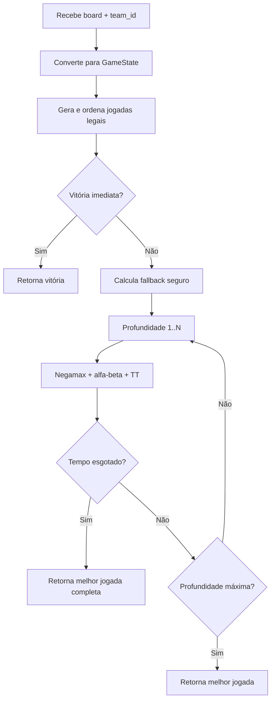

# Relatório Técnico — PI5 API AI

**Disciplina:** PI5 — Aplicações de IA  
**Projeto:** API de jogadores autônomos para jogo de estratégia em tabuleiro 5×5  
**Repositório:** `pi5-api-ai`

---

## 1. Introdução

Este relatório descreve a arquitetura completa da aplicação desenvolvida para a competição acadêmica de IA em jogos de tabuleiro. A API expõe três motores de decisão distintos — evolução incremental de complexidade — que recebem o estado de uma partida via HTTP e devolvem a próxima jogada no formato exigido pelo orquestrador externo.

O jogo é determinístico, de informação perfeita e inspirado em mecânicas de Santorini: dois times com dois professores cada movem-se em casas adjacentes, constroem blocos de altura crescente e vencem ao entrar numa casa de nível 3.

---

## 2. Estrutura do Repositório

```
pi5-api-ai/
├── app/
│   ├── main.py          # API FastAPI e roteamento dos três motores
│   ├── schemas.py       # Contratos de entrada/saída (Pydantic)
│   ├── logic_v1.py      # Motor V1 — heurística gulosa
│   ├── logic_v2.py      # Motor V2 — lookahead tático de 1 turno
│   └── logic_v3.py      # Motor V3 — busca adversarial (jogador competitivo)
├── logic_v1_documentacao.md
├── logic_v2_documentacao.md
├── logic_v3_documentacao.md
├── requirements.txt     # Dependências Python (FastAPI, Uvicorn, Pydantic)
├── Procfile             # Deploy (Heroku/Railway): uvicorn em 0.0.0.0:$PORT
├── README.md            # Documentação operacional e referência rápida
└── REPORT.md            # Este relatório
```

A pasta `app/` concentra todo o código executável. Os arquivos `logic_v*_documentacao.md` na raiz são documentação técnica detalhada de cada motor, escritos durante o desenvolvimento para registrar decisões de design e calibrar pesos heurísticos.

---

## 3. Arquitetura da Aplicação

### 3.1. Visão geral do fluxo

A API **não** controla a partida inteira. Ela atua como um jogador remoto: o backend da competição envia o estado atual e espera uma resposta válida dentro do prazo de timeout.

```
Orquestrador da competição
        │
        ▼  POST /move | /move-v2 | /move-v3
   FastAPI (main.py)
        │
        ├── turn_phase == setup_placement  →  choose_setup()
        └── turn_phase == player_turn      →  choose_turn()
        │
        ▼
   SetupResponse  ou  PlayerTurnResponse
        │
        ▼
   Orquestrador aplica a jogada no tabuleiro
```

### 3.2. Camada HTTP — `main.py`

O arquivo `main.py` instancia a aplicação FastAPI (`PalermaBot Arena Multi-Engine`, versão 1.3.0) e expõe quatro rotas:

| Rota | Motor | Descrição |
|------|-------|-----------|
| `GET /health` | — | Health check; retorna a data atual |
| `POST /move` | V1 | PalermaBot_1 — heurística gulosa |
| `POST /move-v2` | V2 | palerma_Lookahead_v2_turbo_vtec |
| `POST /move-v3` | V3 | Boboca — Negamax competitivo |

Cada endpoint segue o mesmo contrato: recebe um `AITurnRequest`, identifica a fase do turno (`setup_placement` ou `player_turn`) e delega para a função correspondente do motor escolhido. Erros são capturados e devolvidos como HTTP 500 (ou 422 na V3 quando não há jogada legal).

A separação por endpoint permite registrar bots diferentes na competição sem alterar código — basta apontar cada inscrição para a URL desejada.

### 3.3. Camada de contrato — `schemas.py`

Os modelos Pydantic garantem validação automática do payload recebido do orquestrador:

- **`Cell`**: nível da construção (0–4) e professor ocupando a casa (ou `null`).
- **`AITurnRequest`**: `game_id`, `turn_number`, `turn_phase`, `your_team`, matriz `board` 5×5 e, no setup, `professor_to_place`.
- **`SetupResponse`**: coordenada `(row, col)` para posicionamento inicial.
- **`PlayerTurnResponse`**: professor a mover, destino `move_to` e construção `mentor_at` (omitida em vitória imediata).

Os times são identificados por enum:

| `your_team` | Professores |
|-------------|-------------|
| 1 (TURING)  | CLARO, REY  |
| 2 (LOVELACE)| KARIN, BEATRIZ |

O campo `your_team` é crítico: cada motor usa esse valor para saber quais peças controla. Um valor incorreto faria o bot tentar mover peças adversárias.

### 3.4. Camada de decisão — os três motores

Os três arquivos `logic_v*.py` são **independentes** entre si, mas compartilham a mesma interface pública:

```python
choose_setup(board, team_id) -> SetupResponse
choose_turn(board, team_id)   -> PlayerTurnResponse | None
```

Isso permite evoluir a estratégia sem tocar na camada HTTP.

| Versão | Nome do bot | Abordagem | Profundidade de raciocínio |
|--------|-------------|-----------|----------------------------|
| V1 | PalermaBot_1 | Heurística gulosa | 0 turnos futuros |
| V2 | palerma_Lookahead_v2_turbo_vtec | Lookahead tático | 1 estado após a própria jogada |
| V3 | Boboca | Negamax + alfa-beta | Até 4 ply (configurável) |

A evolução V1 → V2 → V3 não foi reescrita do zero: cada versão incorporou lições da anterior. A V2 herdou a noção de bloqueio e altura da V1, mas passou a simular o tabuleiro resultante. A V3 reutiliza pesos e conceitos táticos da V2 dentro da função de avaliação estática, mas adiciona busca adversarial em cima.

### 3.5. Deploy e execução

**Local:**

```bash
pip install -r requirements.txt
uvicorn app.main:app --reload
```

Documentação interativa em `http://127.0.0.1:8000/docs`.

**Produção:** o `Procfile` inicia o Uvicorn na porta definida pela plataforma (`$PORT`), escutando em `0.0.0.0`. A V3 aceita variáveis de ambiente para calibrar força vs. timeout:

```env
PALERMA_SEARCH_TIME_SECONDS=0.75   # tempo máximo por jogada
PALERMA_MAX_SEARCH_DEPTH=4         # profundidade máxima da busca
```

---

## 4. Modelo do Jogo (Regras Relevantes para a IA)

Compreender as regras é essencial para entender por que certos algoritmos foram escolhidos.

- Tabuleiro **5×5**, 8 direções de movimento (incluindo diagonais).
- Cada turno: escolher um professor → mover para casa adjacente vazia → construir (+1 nível) numa casa adjacente ao destino.
- Não se pode subir mais de **1 nível** por movimento.
- Casas de **nível 4** (graduadas) são bloqueadas.
- Mover para **nível 3** = vitória imediata (sem construção).
- A casa de origem fica livre após o movimento e pode receber construção.

Essas regras tornam o jogo um candidato natural para busca adversarial: estado discreto, informação perfeita, sem aleatoriedade, árvore de jogadas finita por turno.

---

## 5. Jogador Inteligente — Estratégia

Esta seção descreve como construímos o jogador competitivo (**Boboca**, motor V3), como o testamos e quais algoritmos o sustentam. As versões V1 e V2 aparecem como etapas do processo — não como produto final, mas como laboratório que validou hipóteses antes da busca profunda.

### 5.1. Filosofia de design

A premissa central do Boboca é:

> **Uma jogada só é boa se continuar boa depois da melhor resposta do adversário.**

Bots gulosos (V1) escolhem a maior nota local. Bots táticos (V2) simulam o tabuleiro após a própria jogada e penalizam ameaças imediatas. O Boboca vai além: alterna turnos entre os dois lados, como um motor de xadrez clássico.

Prioridades em ordem decrescente:

1. Vencer imediatamente, se possível.
2. Impedir vitória imediata do adversário.
3. Nunca entregar vitória ao inimigo com a construção.
4. Simular a melhor resposta adversária (Negamax).
5. Criar ameaças múltiplas (forks táticos).
6. Manter mobilidade e controle do centro.
7. Subir para nível 2 com segurança, preparando ameaça de nível 3.

### 5.2. Processo de construção (evolução incremental)

#### Etapa 1 — PalermaBot_1 (V1): baseline rápido

Começamos com o caminho mais simples: enumerar todas as combinações movimento + construção e pontuar cada uma com uma função heurística (`avaliar_estado`). Critérios: altura alcançada, proximidade do centro, bloqueio de inimigo no nível 2, penalidade por construir nível 3 ao lado de inimigo no nível 2.

**O que aprendemos:** a V1 era rápida e estável, mas perdia partidas contra qualquer adversário que preparasse ameaças com dois turnos de antecedência. Ela não "via" que uma jogada aparentemente boa abria uma vitória forçada para o oponente no turno seguinte.

#### Etapa 2 — palerma_Lookahead_v2_turbo_vtec (V2): simulação de 1 turno

A V2 introduziu dataclasses imutáveis (`ProfessorState`, `Jogada`), geração sistemática de jogadas legais e **aplicação interna da jogada** antes de pontuar. Passou a contar:

- vitórias imediatas que o inimigo teria no próximo turno;
- vitórias imediatas que nós teríamos;
- mobilidade própria vs. inimiga;
- bloqueios reais (construir cúpula nível 4 sobre ameaça).

Pesos explícitos centralizados no topo do arquivo facilitaram calibração:

```python
PESO_BLOQUEIO_VITORIA = 160_000
PESO_DAR_VITORIA_AO_INIMIGO = 180_000
PESO_INIMIGO_VENCE_PROXIMO = 140_000
```

**O que aprendemos:** a V2 parou de cometer "blunders" óbvios (entregar vitória imediata) e passou a vencer a V1 de forma consistente. Porém, ainda não enxergava sequências de 3+ turnos — por exemplo, sacrificar mobilidade agora para forçar uma vitória inevitável depois de duas respostas.

#### Etapa 3 — Boboca (V3): motor adversarial completo

Com a V2 validando a modelagem do jogo (geração de jogadas, detecção de ameaças, aplicação de estado), migramos para busca adversarial. As decisões de engenharia mais importantes:

Embora três versões da IA tenham sido desenvolvidas ao longo do projeto (V1, V2 e V3), apenas a V3 (Boboca) foi utilizada na competição oficial. As versões anteriores serviram como etapas de validação e evolução da estratégia, permitindo testar conceitos, calibrar heurísticas e identificar limitações antes da implementação da solução final. Dessa forma, a V3 representa a entrega final de Inteligência Artificial do projeto.

**Representação interna otimizada.** O tabuleiro 5×5 é linearizado em 25 índices (`GameState` imutável com tuplas). Professores viram índices 0–3 em vez de strings. Vizinhos de cada casa são pré-computados (`NEIGHBORS`). Isso torna cópia de estado, hashing e cache baratos — requisito para explorar milhares de nós por jogada.

**Geração completa de jogadas.** `generate_moves` enumera movimentos legais respeitando todas as regras, incluindo vitória terminal (nível 3, sem construção).

**Função de avaliação estática.** Quando a busca atinge profundidade zero, `evaluate_state` pontua a posição considerando altura, centro, mobilidade, ameaças imediatas, ameaças duplas, coordenação entre professores e risco de travamento. A ameaça inimiga pesa mais que a própria (`-180.000` vs. `+140.000`), tornando o bot defensivamente prudente.

**Ordenação de jogadas (move ordering).** Antes da busca, jogadas são ordenadas por prioridade: vitória > bloqueio > evitar entregar vitória > subir de nível > centro. Isso acelera drasticamente a poda alfa-beta — jogadas boas analisadas primeiro cortam ramos inteiros.

**Limite de candidatos por profundidade.** Em profundidades altas, apenas as N jogadas mais promissoras são exploradas (`CANDIDATE_LIMIT_BY_DEPTH`), equilibrando força e tempo de resposta.

### 5.3. Algoritmos utilizados

#### Negamax

Variante compacta do Minimax baseada na identidade:

```
valor_para_mim = −valor_para_o_adversário
```

Implementado recursivamente em `SearchEngine.negamax`. Cada chamada alterna o time via `_opponent(team_id)` e nega o score retornado pelo filho. Simplifica o código em relação a Minimax clássico com funções separadas `maximize`/`minimize`.

#### Poda alfa-beta

Durante a expansão de jogadas, mantemos janela `[alpha, beta]`. Se `alpha >= beta`, ramos restantes são descartados — o adversário já tem resposta melhor. Com boa ordenação de jogadas, a poda reduz a árvore explorada em ordens de magnitude.

#### Tabela de transposição

Estados já avaliados são cacheados com chave `(levels, positions, team_id, depth)`. Entradas armazenam score, profundidade, flag (`EXACT`, `LOWER`, `UPPER`) e melhor jogada conhecida. Posições alcançáveis por ordens diferentes de jogadas são reutilizadas sem recálculo.

#### Aprofundamento iterativo (iterative deepening)

A busca avança profundidade 1 → 2 → 3 → 4. Se o tempo acabar na profundidade 4, a melhor jogada da profundidade 3 completa é mantida. Benefícios:

- nunca retorna "vazio" por timeout;
- a melhor jogada da profundidade N−1 guia a ordenação na profundidade N (principal variation first);
- interrompe cedo se encontrar vitória forçada (`score >= WIN_SCORE - 1000`).

#### Controle de tempo

Verificação de deadline a cada 1024 nós (`SearchTimeout`), minimizando overhead. Padrão: **0,75 s** por requisição — margem segura para timeouts de API em competição.

#### Fallback seguro

Antes da busca profunda, `_fallback_move` calcula a melhor jogada por avaliação de 1 lance, penalizando fortemente entregar vitória imediata ao inimigo (`−900.000.000`). Se a busca não completar, esse fallback garante uma jogada defensivamente aceitável.

#### Setup competitivo

O posicionamento inicial (`choose_setup`) usa heurística própria: centro, mobilidade, distância 2 do aliado (cobertura sem bloqueio mútuo), evitar colar no inimigo, desempate determinístico por mapa de aberturas preferidas.

### 5.4. Diagrama do fluxo de decisão (V3)



### 5.5. Como testamos

O projeto não possui suíte automatizada de testes unitários (identificada como melhoria futura no README). A validação foi feita por **três camadas complementares**:

#### a) Testes manuais via HTTP (curl / Swagger)

Cada motor foi exercitado localmente com payloads reais do orquestrador:

```bash
curl -X POST http://127.0.0.1:8000/move-v3 \
  -H "Content-Type: application/json" \
  -d '{ "game_id": "teste", "turn_number": 1, ... }'
```

Casos verificados manualmente:

- setup em tabuleiro vazio → resposta no centro `(2, 2)` ou anel interno;
- turno normal com vitória imediata disponível → bot escolhe vitória;
- posição onde construir nível 3 entregaria vitória ao inimigo → bot evita;
- posição com ameaça inimiga de nível 3 → bot bloqueia com cúpula (nível 4);
- `your_team` alternado (1 e 2) → professores corretos movidos.

O endpoint `/docs` (Swagger UI) facilitou iteração rápida com tabuleiros customizados.

#### b) Torneios entre versões (V1 vs V2 vs V3)

A principal forma de medir progresso foi **partidas cruzadas** entre os três motores, alternando os lados:

```
V3 (Time 1) × V1 (Time 2)
V1 (Time 1) × V3 (Time 2)
V3 (Time 1) × V2 (Time 2)
...
```

Isso evita viés de ordem de setup ou primeira jogada. Resultados observados durante o desenvolvimento:

| Confronto | Resultado típico |
|-----------|------------------|
| V1 × V2 | V2 vence consistentemente; V1 comete blunders táticos |
| V2 × V3 | V3 vence na maioria; V2 segura em posições simples |
| V3 × V3 | Empates ou vitórias por timeout/heurística em posições simétricas |

#### c) Testes de stress de timeout

Como a V3 opera sob limite de tempo, testamos configurações extremas:

| Configuração | Comportamento |
|--------------|---------------|
| `TIME=0.25s, DEPTH=3` | Respostas rápidas; joga parecido com V2 em posições complexas |
| `TIME=0.75s, DEPTH=4` | **Padrão competitivo** — equilíbrio força/latência |
| `TIME=1.20s, DEPTH=5` | Mais forte, risco de timeout do orquestrador |

Verificamos que o fallback nunca retorna jogada que entrega vitória imediata, mesmo com tempo mínimo.

#### d) Depuração posicional (análise manual de posições)

Para posições específicas onde o bot escolheu jogada surpreendente (boa ou ruim), inspecionamos:

- quantos nós a busca explorou;
- score retornado pelo Negamax;
- se a tabela de transposição reutilizou estados;
- comparação com o que V2 escolheria na mesma posição.

Isso calibrou pesos como `WIN_SCORE = 1_000_000_000` (garantir que vitória real sempre supera vantagem posicional) e a penalidade de ameaça dupla inimiga (`−220.000`).

### 5.6. Comparação final entre os três motores

| Critério | V1 (Guloso) | V2 (Lookahead) | V3 (Boboca) |
|----------|-------------|----------------|-------------|
| Algoritmo | Score local | Simulação 1 turno | Negamax + α-β |
| Simula adversário | Não | Ameaças imediatas | Melhor resposta completa |
| Representação | Matriz + dicts | Dataclasses | Estado imutável linearizado |
| Tabela de transposição | Não | Não | Sim |
| Controle de tempo | Desnecessário | Desnecessário | Sim (0,75 s padrão) |
| Fallback | Não | Não | Sim |
| Força competitiva | Média | Alta | Muito alta |
| Latência | Mínima | Baixa | Média |

A escolha da V3 como versão oficial da competição ocorreu após diversos testes comparativos entre os três motores. Os resultados demonstraram que a V3 apresentava maior capacidade de antecipar ameaças, bloquear vitórias adversárias e construir planos de médio prazo.

Enquanto a V1 tomava decisões exclusivamente locais e a V2 analisava apenas consequências imediatas, a V3 conseguia avaliar sequências completas de jogadas através da busca Negamax com poda alfa-beta.

Além do ganho estratégico, a V3 manteve tempos de resposta compatíveis com os limites da competição por meio de mecanismos de otimização como tabela de transposição, ordenação de movimentos e aprofundamento iterativo.

Por esses motivos, a equipe definiu a V3 (Boboca) como a entrega final de Inteligência Artificial do projeto e a versão utilizada nas partidas oficiais do torneio.
### 5.7. Limitações conhecidas e trabalho futuro

- **Pesos manuais:** a função de avaliação não foi treinada por self-play; os pesos foram calibrados empiricamente.
- **Poda de candidatos:** limitar jogadas por profundidade pode descartar movimentos surpresa de longo prazo.
- **Profundidade finita:** a busca não resolve o jogo até o terminal — depende da heurística em posições profundas.
- **Sem livro de aberturas:** o setup é heurístico, não memorizado.
- **Sem testes automatizados:** regressões futuras exigiriam simulador local (melhoria planejada).

Possíveis evoluções documentadas: killer moves, history heuristic, quiescence search, self-play para calibrar pesos, MCTS experimental.

---

## 6. Conclusão

A aplicação `pi5-api-ai` implementa uma arquitetura modular em três camadas — HTTP, contrato e decisão — que hospeda três gerações de IA para o mesmo jogo. O jogador competitivo **Boboca** (V3) combina técnicas clássicas de motores de jogos (Negamax, poda alfa-beta, tabela de transposição, aprofundamento iterativo) com heurísticas táticas refinadas nas versões anteriores, operando dentro de limites de tempo compatíveis com uma API REST em produção.

A estratégia de desenvolvimento — baseline guloso, lookahead tático, busca adversarial — permitiu validar cada camada antes de aumentar a complexidade, e os testes por confronto direto entre versões demonstraram ganhos reais de força a cada iteração.

---

## Referências internas

- `README.md` — instalação, endpoints, exemplos curl
- `logic_v1_documentacao.md` — detalhes do PalermaBot_1
- `logic_v2_documentacao.md` — detalhes do Lookahead V2
- `logic_v3_documentacao.md` — detalhes completos do Boboca (58 seções)
