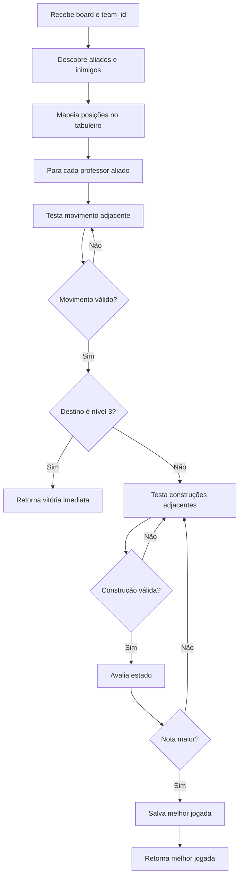

# Documentação Técnica — PalermaBot_1 (`logic_v1.py`)

## 1. Visão geral

O **PalermaBot_1** é a primeira inteligência artificial do projeto. Ele é implementado no arquivo `[logic_v1.py](https://github.com/EricDonat0/pi5-api-ai/blob/main/app/logic_v1.py)` e funciona como um bot **heurístico guloso**: em cada turno, ele gera todas as jogadas legais disponíveis no tabuleiro, calcula uma nota para cada combinação de movimento + construção e escolhe a maior nota.

Em termos simples, ele **não simula o futuro completo da partida**. Ele olha o estado atual, calcula o impacto imediato da própria jogada e retorna a ação que parece mais forte naquele momento. Isso faz dele uma IA rápida, simples, estável e fácil de entender, mas também mais vulnerável a armadilhas de médio prazo.

### Identidade do bot

| Item | Valor |
|---|---|
| Nome do jogador | `PalermaBot_1` |
| Arquivo | `logic_v1.py` |
| Tipo de IA | Heurística gulosa |
| Profundidade de busca | 0 turnos futuros completos |
| Simula resposta inimiga? | Não |
| Prioridade principal | Altura, centro, bloqueios locais e construção de escadas |
| Pontos fortes | Simples, rápido, previsível, bom contra bots fracos |
| Pontos fracos | Pode cair em táticas de 1 ou 2 turnos, não enxerga ameaças futuras completas |

---

## 2. Contexto do jogo

O jogo é inspirado em Santorini/Palerma. O tabuleiro tem tamanho fixo de **5x5**. Cada célula possui:

- `level`: altura da construção naquela casa;
- `professor`: nome do professor ocupando a casa, ou `None` se estiver vazia.

A lógica da IA assume as seguintes regras principais:

1. Um professor se move para uma casa adjacente.
2. A casa de destino precisa estar dentro do tabuleiro.
3. A casa de destino precisa estar vazia.
4. O professor não pode subir mais de 1 nível por movimento.
5. Casas de nível `4` são bloqueadas.
6. Mover para uma casa de nível `3` representa vitória.
7. Depois de mover, o professor constrói em uma casa adjacente ao destino.
8. A casa de origem fica livre depois do movimento, então pode receber construção.

---

## 3. Estrutura geral do arquivo

O arquivo possui as seguintes partes principais:

```text
logic_v1.py
├── imports
├── DIRECOES
├── get_professores_por_time()
├── pos_valida()
├── choose_setup()
├── choose_turn()
└── avaliar_estado()
```

Cada função tem uma responsabilidade bem definida:

| Função | Responsabilidade |
|---|---|
| `get_professores_por_time` | Descobre quais professores pertencem ao time atual e quais são inimigos |
| `pos_valida` | Verifica se uma coordenada está dentro do tabuleiro 5x5 |
| `choose_setup` | Escolhe onde posicionar um professor na fase inicial |
| `choose_turn` | Escolhe movimento e construção no turno normal |
| `avaliar_estado` | Dá uma pontuação para uma jogada candidata |

---

## 4. Representação de direção e vizinhança

O bot considera oito direções possíveis para movimento e construção:

```python
DIRECOES = [
    (-1, -1), (-1, 0), (-1, 1),
    (0, -1),           (0, 1),
    (1, -1),  (1, 0),  (1, 1)
]
```

Isso significa que ele enxerga como adjacentes:

- cima;
- baixo;
- esquerda;
- direita;
- diagonais.

Essa estrutura é usada tanto para:

1. procurar movimentos possíveis;
2. procurar construções possíveis;
3. calcular proximidade com inimigos.

### Exemplo visual

Para uma peça na casa central `X`, as casas avaliadas são:

```text
A A A
A X A
A A A
```

---

## 5. Separação de times

A função `get_professores_por_time` define os professores aliados e inimigos conforme o `team_id` recebido da API:

```python
def get_professores_por_time(team_id: int) -> Tuple[List[str], List[str]]:
    meus = ["CLARO", "REY"] if team_id == 1 else ["KARIN", "BEATRIZ"]
    inimigos = ["KARIN", "BEATRIZ"] if team_id == 1 else ["CLARO", "REY"]
    return meus, inimigos
```

A lógica é:

| `team_id` | Professores aliados | Professores inimigos |
|---|---|---|
| `1` | `CLARO`, `REY` | `KARIN`, `BEATRIZ` |
| `2` | `KARIN`, `BEATRIZ` | `CLARO`, `REY` |

Essa função é crucial porque toda decisão posterior depende dela. Se o backend enviar `your_team` errado, a IA tentará controlar os professores errados.

---

## 6. Validação de coordenadas

A função `pos_valida` garante que uma coordenada está dentro do tabuleiro:

```python
def pos_valida(r: int, c: int) -> bool:
    return 0 <= r < 5 and 0 <= c < 5
```

Como o tabuleiro é 5x5, linhas e colunas válidas vão de `0` a `4`.

Exemplos:

| Coordenada | Resultado |
|---|---|
| `(0, 0)` | válida |
| `(2, 2)` | válida |
| `(4, 4)` | válida |
| `(-1, 2)` | inválida |
| `(5, 1)` | inválida |

---

## 7. Estratégia de setup

A função `choose_setup` é responsável pela fase de posicionamento inicial.

```python
def choose_setup(board: list[list[Cell]]) -> SetupResponse:
    preferencias = [
        (2, 2),
        (1, 2), (2, 1), (2, 3), (3, 2),
        (1, 1), (1, 3), (3, 1), (3, 3)
    ]

    for r, c in preferencias:
        if board[r][c].level == 0 and board[r][c].professor is None:
            return SetupResponse(row=r, col=c)
```

### Estratégia usada

O bot tenta dominar o centro do tabuleiro. A ordem de preferência é:

1. centro absoluto `(2, 2)`;
2. casas ortogonais ao centro;
3. diagonais internas.

Essa escolha faz sentido porque o centro tem maior mobilidade. Em um tabuleiro 5x5:

- cantos têm 3 vizinhos;
- bordas têm 5 vizinhos;
- casas internas têm 8 vizinhos.

Logo, um professor no centro costuma ter mais opções de movimento e construção.

### Ordem de preferência

```text
Prioridade 1:
(2,2)

Prioridade 2:
(1,2), (2,1), (2,3), (3,2)

Prioridade 3:
(1,1), (1,3), (3,1), (3,3)
```

### Fallback aleatório

Se todas as casas preferidas estiverem ocupadas, o bot seleciona uma casa livre aleatória:

```python
candidates = [
    (r, c) for r in range(5) for c in range(5)
    if board[r][c].level == 0 and board[r][c].professor is None
]

row, col = random.choice(candidates)
return SetupResponse(row=row, col=col)
```

Esse fallback evita que o bot quebre caso o centro esteja ocupado. Porém, ele introduz um componente aleatório na abertura.

### Força do setup da V1

Pontos positivos:

- escolhe regiões de alta mobilidade;
- é extremamente rápido;
- funciona bem no começo do jogo.

Limitações:

- não considera qual professor está sendo posicionado;
- não considera a posição dos aliados;
- não considera a posição dos inimigos;
- pode colocar os dois professores perto demais;
- pode repetir padrões previsíveis.

---

## 8. Fluxo geral do turno

A função `choose_turn` é o núcleo do bot.

Fluxo resumido:

```text
1. Descobrir meus professores e os inimigos.
2. Mapear posições dos meus professores.
3. Mapear posições dos professores inimigos.
4. Para cada professor aliado:
   4.1. testar todos os movimentos adjacentes.
   4.2. se o movimento for para nível 3, vencer imediatamente.
   4.3. testar todas as construções possíveis após o movimento.
   4.4. pontuar movimento + construção.
5. Retornar a jogada com maior pontuação.
```

Em forma de pseudocódigo:

```text
melhor_jogada = nenhuma
melhor_nota = -infinito

para cada professor aliado:
    para cada casa adjacente:
        se movimento for legal:
            se destino for nível 3:
                retornar vitória

            para cada construção adjacente ao destino:
                se construção for legal:
                    nota = avaliar_estado(...)
                    se nota > melhor_nota:
                        salvar essa jogada

retornar melhor_jogada
```

---

## 9. Mapeamento das peças no tabuleiro

No início de `choose_turn`, a IA percorre todas as 25 casas:

```python
minhas_posicoes = []
inimigos_posicoes = []

for r in range(5):
    for c in range(5):
        prof = board[r][c].professor
        if prof in meus_professores:
            minhas_posicoes.append({"nome": prof, "r": r, "c": c, "lvl": board[r][c].level})
        elif prof in inimigos:
            inimigos_posicoes.append({"nome": prof, "r": r, "c": c, "lvl": board[r][c].level})
```

O resultado é uma lista de dicionários, por exemplo:

```python
minhas_posicoes = [
    {"nome": "CLARO", "r": 2, "c": 2, "lvl": 1},
    {"nome": "REY", "r": 3, "c": 1, "lvl": 0},
]
```

Essa estrutura é simples e direta. Cada professor carrega:

- nome;
- linha;
- coluna;
- nível atual.

---

## 10. Validação de movimento

Para cada professor aliado, o bot testa as oito direções.

```python
mov_r, mov_c = aliado["r"] + dr, aliado["c"] + dc

if pos_valida(mov_r, mov_c):
    casa_mov = board[mov_r][mov_c]
    if casa_mov.professor is None and casa_mov.level <= aliado["lvl"] + 1 and casa_mov.level < 4:
        ...
```

Um movimento é legal se:

1. a casa está dentro do tabuleiro;
2. a casa não tem professor;
3. a altura da casa de destino é no máximo `altura_atual + 1`;
4. o nível da casa é menor que `4`.

### Exemplo

Se um professor está no nível `1`, ele pode mover para:

- nível `0`;
- nível `1`;
- nível `2`.

Mas não pode mover diretamente para nível `3`, porque subiria dois níveis.

Se estiver no nível `2`, ele pode mover para nível `3` e vencer.

---

## 11. Vitória imediata

A regra de vitória é detectada assim:

```python
if casa_mov.level == 3:
    for br, bc in DIRECOES:
        bld_r, bld_c = mov_r + br, mov_c + bc
        if pos_valida(bld_r, bld_c) and ...:
            return PlayerTurnResponse(
                professor=aliado["nome"],
                move_to=Position(row=mov_r, col=mov_c),
                mentor_at=Position(row=bld_r, col=bld_c)
            )
```

A intenção é correta: se o professor consegue mover para uma casa nível `3`, a partida termina.

### Detalhe técnico importante

Nesta V1, mesmo em jogada de vitória, o código procura uma construção válida e retorna `mentor_at`. Isso costuma funcionar se sempre existir alguma construção possível. Porém, em algumas regras ou validadores, a vitória não precisa de construção. Uma implementação mais robusta poderia retornar `mentor_at=None` quando o destino é nível `3`.

### Estratégia de vitória

A V1 não tenta criar vitórias forçadas complexas. Ela simplesmente:

1. encontra uma vitória imediata;
2. retorna imediatamente;
3. não avalia mais nenhuma jogada.

Isso é uma decisão correta, porque vitória imediata deve ter prioridade absoluta.

---

## 12. Validação de construção

Depois de um movimento válido, o bot testa todas as casas adjacentes ao novo destino:

```python
if pos_valida(bld_r, bld_c) and board[bld_r][bld_c].level < 4 and (
    board[bld_r][bld_c].professor is None or (bld_r == aliado["r"] and bld_c == aliado["c"])
):
    ...
```

Uma construção é legal se:

1. está dentro do tabuleiro;
2. a casa tem nível menor que `4`;
3. a casa está vazia depois do movimento;
4. a casa de origem é permitida, porque fica vazia após o professor sair.

Esse último ponto é importante. Se o professor sai de `(2,2)` para `(2,3)`, a casa `(2,2)` passa a estar livre e pode receber construção.

---

## 13. Função de avaliação: `avaliar_estado`

A função `avaliar_estado` é o cérebro estratégico do bot. Ela calcula uma pontuação para cada jogada candidata.

Assinatura:

```python
def avaliar_estado(
    mov_r: int,
    mov_c: int,
    lvl_novo: int,
    bld_r: int,
    bld_c: int,
    bld_lvl: int,
    inimigos: List[dict]
) -> int:
```

Parâmetros:

| Parâmetro | Significado |
|---|---|
| `mov_r`, `mov_c` | posição para onde o professor vai se mover |
| `lvl_novo` | nível da casa de destino |
| `bld_r`, `bld_c` | posição da construção |
| `bld_lvl` | nível da casa antes da construção |
| `inimigos` | lista com posição e nível dos professores inimigos |

---

## 14. Critério 1 — altura

A primeira pontuação é:

```python
pontos = lvl_novo * 1000
```

Isso significa:

| Nível destino | Pontuação base |
|---|---:|
| 0 | 0 |
| 1 | 1000 |
| 2 | 2000 |
| 3 | tratado como vitória antes da heurística |

A ideia é incentivar o bot a subir. No Santorini-like, estar alto é vantagem porque aproximar-se do nível `3` cria ameaça de vitória.

---

## 15. Critério 2 — construção de escada própria

O bot calcula o novo nível da casa construída:

```python
novo_lvl_construido = bld_lvl + 1
```

Depois aplica:

```python
if lvl_novo == 2 and novo_lvl_construido == 3:
    dist_mov_bld = max(abs(mov_r - bld_r), abs(mov_c - bld_c))
    if dist_mov_bld <= 1:
        pontos += 5000
```

Tradução estratégica:

> Se meu professor ficou no nível `2` e eu construí uma casa de nível `3` ao lado dele, criei uma ameaça de vitória para o próximo turno.

Essa é uma das ideias mais fortes da V1. Ela tenta criar o padrão:

```text
Professor no nível 2 + casa nível 3 adjacente = ameaça de vitória.
```

Pontuação: `+5000`.

---

## 16. Critério 3 — construção como degrau natural

```python
if novo_lvl_construido == lvl_novo + 1:
    pontos += 300
```

A lógica aqui é criar uma escada progressiva. Exemplo:

- professor no nível `0`, construir nível `1` perto dele;
- professor no nível `1`, construir nível `2` perto dele;
- professor no nível `2`, construir nível `3` perto dele.

Esse bônus é pequeno comparado ao bônus de ameaça direta, mas ajuda a organizar a construção de caminho vertical.

---

## 17. Critério 4 — controle do centro

```python
pontos -= (abs(mov_r - 2) + abs(mov_c - 2)) * 10
```

Essa regra penaliza a distância Manhattan até o centro `(2,2)`.

| Destino | Distância ao centro | Penalidade |
|---|---:|---:|
| `(2,2)` | 0 | 0 |
| `(2,1)` | 1 | -10 |
| `(1,1)` | 2 | -20 |
| `(0,0)` | 4 | -40 |

Esse peso é baixo em comparação com altura e bloqueios. Ou seja, o centro é um desempate estratégico, mas não supera uma ameaça de vitória ou bloqueio crítico.

---

## 18. Critério 5 — bloqueio crítico do inimigo

A V1 analisa cada inimigo:

```python
if inimigo["lvl"] == 2 and dist_inimigo_bld <= 1:
    if novo_lvl_construido == 4:
        pontos += 8000 # Bloqueio Crítico
    elif novo_lvl_construido == 3:
        pontos -= 10000 # Falha Crítica
```

Isso é muito importante.

Se um inimigo está no nível `2`, ele quer subir para nível `3`. Então:

- construir uma casa de nível `3` ao lado dele pode entregar vitória;
- transformar uma casa de nível `3` em nível `4` pode bloquear vitória.

### Interpretação

| Situação | Pontuação | Motivo |
|---|---:|---|
| inimigo nível 2 e construção vira nível 4 | `+8000` | bloqueia uma casa perigosa |
| inimigo nível 2 e construção vira nível 3 | `-10000` | pode dar vitória ao inimigo |

Essa é uma correção estratégica importante em relação a versões mais ingênuas da IA.

---

## 19. Critério 6 — não ajudar inimigo nível 1

```python
if inimigo["lvl"] == 1 and dist_inimigo_bld <= 1 and novo_lvl_construido == 2:
    pontos -= 2000
```

Se o inimigo está no nível `1`, uma casa nível `2` ao lado dele é útil para ele subir. A V1 penaliza essa construção.

Essa regra é menos grave que entregar uma casa nível `3` para inimigo nível `2`, mas ainda assim é considerada ruim.

---

## 20. Critério 7 — evitar ficar ao alcance do inimigo

```python
if dist_inimigo_mov <= 1 and inimigo["lvl"] >= lvl_novo - 1:
    pontos -= 500
```

A ideia é não mover para uma casa adjacente a um inimigo que possa disputar altura com você.

Exemplo:

- você vai para nível `2`;
- inimigo adjacente está no nível `1` ou `2`;
- ele pode reagir, bloquear ou ameaçar sua posição.

A penalidade é pequena (`-500`), então ela não impede jogadas fortes, mas evita posicionamentos perigosos quando as opções são parecidas.

---

## 21. Estratégia global do PalermaBot_1

A estratégia do bot pode ser resumida assim:

```text
1. Nascer no centro.
2. Subir de nível rapidamente.
3. Criar escadas próprias.
4. Bloquear inimigo em nível 2.
5. Evitar construir nível 3 para o inimigo.
6. Escolher a maior pontuação imediata.
```

Ele joga de maneira **territorial e vertical**. O objetivo dele é controlar as casas centrais, subir até o nível `2` e criar uma casa nível `3` adjacente para vencer na próxima oportunidade.

---

## 22. Fluxograma da IA



---

## 23. Exemplo de decisão

Imagine este cenário:

- `CLARO` está no nível `1`;
- existe uma casa nível `2` adjacente;
- ao mover para essa casa, ele pode construir uma casa nível `3` ao lado.

A V1 daria pontuação alta porque:

```text
nível destino = 2       => +2000
criou nível 3 adjacente => +5000
centro talvez ajude      => pequena variação
```

Total aproximado: acima de `7000`, antes das penalidades.

Isso provavelmente será escolhido, a menos que exista um bloqueio crítico ainda mais importante.

---

## 24. Complexidade computacional

O tabuleiro é pequeno, então a V1 é muito leve.

Para cada turno:

- máximo de 2 professores aliados;
- cada professor testa até 8 movimentos;
- cada movimento testa até 8 construções.

No pior caso, a IA avalia cerca de:

```text
2 * 8 * 8 = 128 combinações
```

Isso é muito barato para uma API.

### Consequência prática

A V1 praticamente nunca deveria perder por timeout. Ela é adequada para ambientes com tempo de resposta curto.

---

## 25. Pontos fortes

### 25.1 Simplicidade

O código é curto, direto e fácil de depurar.

### 25.2 Velocidade

Como não há simulação profunda, a resposta é quase instantânea.

### 25.3 Boas regras locais

A IA entende conceitos importantes:

- subir é bom;
- centro é bom;
- nível `2` ameaça vitória;
- bloquear inimigo nível `2` com nível `4` é forte;
- criar nível `3` para inimigo nível `2` é perigoso.

### 25.4 Pouco risco técnico

Como o algoritmo é pequeno, há menos chance de erro de execução.

---

## 26. Limitações

### 26.1 Não simula resposta adversária

A maior limitação é que a V1 não pergunta:

> Depois que eu fizer essa jogada, o inimigo vence?

Ela só tenta evitar padrões perigosos locais.

### 26.2 Não detecta ameaças duplas

Se o inimigo cria duas ameaças de vitória, talvez seja impossível bloquear ambas. A V1 não mede isso diretamente.

### 26.3 Setup pouco contextual

O setup não considera `team_id`, aliados ou inimigos. Ele só segue uma lista fixa.

### 26.4 Vitória imediata depende de construção válida

O código procura uma construção mesmo quando o movimento já vence. Se o validador do jogo permitir vitória sem construção, esta V1 poderia ser simplificada para retornar `mentor_at=None` nesses casos.

### 26.5 Pode ser previsível

A abertura fixa facilita que bots mais fortes antecipem suas posições.

---

## 27. Quando a V1 tende a vencer

Ela tende a se sair bem contra bots que:

- jogam aleatoriamente;
- não bloqueiam nível `3`;
- constroem casas úteis para o adversário;
- não percebem ameaça de professor em nível `2`;
- ficam nas bordas do tabuleiro.

---

## 28. Quando a V1 tende a perder

Ela sofre contra bots que:

- simulam o próximo turno;
- bloqueiam ameaças imediatas;
- criam ameaças duplas;
- sacrificam uma vantagem local para ganhar dois turnos depois;
- reduzem mobilidade em vez de só subir.

---

## 29. Estratégia de jogo recomendada para essa IA

O estilo ideal do PalermaBot_1 é:

1. **Abrir no centro** para manter mobilidade.
2. **Subir rápido para nível 1 e 2**.
3. **Criar nível 3 adjacente quando estiver no nível 2**.
4. **Bloquear qualquer inimigo nível 2 com cúpula**.
5. **Evitar construir degraus para o inimigo**.
6. **Não depender de finais longos**, pois o bot não calcula muito à frente.

---

## 30. Sugestões de melhoria futura

Se o objetivo fosse evoluir a V1 sem transformá-la completamente em V2 ou V3, as melhorias naturais seriam:

### 30.1 Corrigir vitória imediata com `mentor_at=None`

```python
if casa_mov.level == 3:
    return PlayerTurnResponse(
        professor=aliado["nome"],
        move_to=Position(row=mov_r, col=mov_c),
        mentor_at=None,
    )
```

### 30.2 Simular vitória inimiga no próximo turno

Depois de aplicar uma jogada candidata, verificar se o adversário teria movimento para nível `3`.

### 30.3 Melhorar setup

Considerar:

- posição do primeiro aliado;
- distância do inimigo;
- mobilidade real;
- evitar dois professores colados.

### 30.4 Adicionar logs de decisão

Registrar:

- jogada escolhida;
- pontuação;
- motivo principal;
- ameaças detectadas.

---

## 31. Resumo executivo

O **PalermaBot_1** é uma IA de primeira geração, baseada em heurística gulosa. Ele é rápido e bom em decisões locais: centro, altura, bloqueio de inimigo e criação de escadas. Sua principal fraqueza é não simular a melhor resposta do adversário. Em competição, ele é confiável e estável, mas tende a perder para IAs que fazem lookahead ou busca adversarial.

### Classificação final

| Critério | Nota conceitual |
|---|---|
| Velocidade | Muito alta |
| Segurança técnica | Alta |
| Estratégia local | Boa |
| Defesa tática | Média |
| Planejamento futuro | Baixo |
| Força competitiva | Intermediária contra bots simples |

