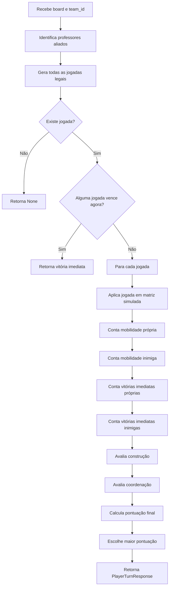

# Documentação Técnica — palerma_Lookahead_v2_turbo_vtec (`logic_v2.py`)

## 1. Visão geral

O **palerma_Lookahead_v2_turbo_vtec** é a segunda inteligência artificial do projeto. Ele é implementado no arquivo `logic_v2.py` e representa uma evolução importante em relação ao `PalermaBot_1`.

Enquanto a V1 escolhe a melhor jogada apenas por uma nota local, a V2 faz uma análise tática mais completa: ela gera todas as jogadas legais, simula o estado resultante do tabuleiro e avalia consequências imediatas para os dois lados. Por isso, ela pode ser descrita como uma IA de **lookahead tático de 1 turno**.

Ela ainda não faz Minimax profundo, mas já é capaz de responder perguntas fundamentais:

- esta jogada vence agora?
- esta jogada entrega vitória ao inimigo?
- esta jogada cria uma ameaça de vitória para mim?
- esta construção bloqueia uma vitória inimiga real?
- esta construção melhora minha mobilidade ou a mobilidade do inimigo?

### Identidade do bot

| Item | Valor |
|---|---|
| Nome do jogador | `palerma_Lookahead_v2_turbo_vtec` |
| Arquivo | `logic_v2.py` |
| Tipo de IA | Heurística tática com simulação de 1 turno |
| Profundidade de busca | 1 estado futuro após a própria jogada |
| Simula resposta inimiga? | Parcialmente, por ameaças imediatas |
| Prioridade principal | Vitória, bloqueio, segurança tática, mobilidade e altura |
| Pontos fortes | Evita blunders, bloqueia ameaças reais, cria ameaças próprias |
| Pontos fracos | Não calcula sequências longas como Minimax/Negamax |

---

## 2. Diferença conceitual entre V1 e V2

A V1 avalia a jogada quase diretamente:

```text
movimento + construção -> nota local -> escolhe maior
```

A V2 faz algo mais estruturado:

```text
movimento + construção -> aplica jogada em uma cópia do estado -> mede ameaças, mobilidade e riscos -> escolhe maior
```

Isso muda muito a qualidade das decisões, porque a V2 não olha apenas o movimento atual, mas também o tabuleiro resultante.

### Exemplo

Se a IA constrói uma casa de nível `3` ao lado de um inimigo que está no nível `2`, a V1 pode detectar isso como perigoso se a posição for simples. A V2 vai além: ela simula o estado e conta se o inimigo realmente terá casas de vitória imediata depois da jogada.

---

## 3. Estrutura geral do arquivo

O arquivo `logic_v2.py` é organizado em blocos:

```text
logic_v2.py
├── Constantes do tabuleiro
├── Pesos da heurística
├── Dataclasses
│   ├── ProfessorState
│   └── Jogada
├── Utilitários de posição e distância
├── Conversão do board para matrizes
├── Setup inteligente
├── Validação de movimentos e construções
├── Geração de jogadas legais
├── Simulação de jogadas
├── Contagem de mobilidade e vitórias imediatas
├── Avaliação de construção
├── Avaliação da jogada completa
└── Funções públicas choose_setup e choose_turn
```

---

## 4. Constantes do jogo

```python
BOARD_SIZE = 5
MAX_LEVEL = 4
WIN_LEVEL = 3
CENTER = (2, 2)
```

Interpretação:

| Constante | Significado |
|---|---|
| `BOARD_SIZE` | tabuleiro 5x5 |
| `MAX_LEVEL` | nível 4 é bloqueio/cúpula/graduação |
| `WIN_LEVEL` | nível 3 é a altura de vitória |
| `CENTER` | centro estratégico do tabuleiro |

A IA usa o centro `(2,2)` como referência para calcular controle territorial.

---

## 5. Direções adjacentes

```python
DIRECOES = (
    (-1, -1), (-1, 0), (-1, 1),
    (0, -1),           (0, 1),
    (1, -1),  (1, 0),  (1, 1),
)
```

A V2 usa as oito direções para:

- mover professores;
- construir em volta do destino;
- calcular proximidade com inimigos;
- identificar ameaças de vitória.

---

## 6. Pesos da heurística

A V2 centraliza alguns pesos importantes:

```python
PESO_VITORIA_PROXIMO_TURNO = 35_000
PESO_BLOQUEIO_VITORIA = 160_000
PESO_DAR_VITORIA_AO_INIMIGO = 180_000
PESO_INIMIGO_VENCE_PROXIMO = 140_000
```

Esses valores indicam a personalidade do bot.

| Peso | Efeito estratégico |
|---|---|
| `PESO_VITORIA_PROXIMO_TURNO` | valoriza criar ameaça própria |
| `PESO_BLOQUEIO_VITORIA` | valoriza bloquear uma vitória real do inimigo |
| `PESO_DAR_VITORIA_AO_INIMIGO` | pune fortemente construir algo que dá vitória ao adversário |
| `PESO_INIMIGO_VENCE_PROXIMO` | pune estados em que o inimigo terá vitória imediata |

A V2 é mais defensiva do que a V1. Ela prefere perder um pouco de altura ou centro se isso evitar entregar vitória.

---

## 7. Dataclass `ProfessorState`

```python
@dataclass(frozen=True)
class ProfessorState:
    nome: str
    r: int
    c: int
    lvl: int
```

Essa classe representa um professor no tabuleiro.

Campos:

| Campo | Significado |
|---|---|
| `nome` | nome do professor (`CLARO`, `REY`, `KARIN`, `BEATRIZ`) |
| `r` | linha |
| `c` | coluna |
| `lvl` | nível atual da casa |

O uso de `dataclass` deixa o código mais legível do que dicionários soltos.

---

## 8. Dataclass `Jogada`

```python
@dataclass(frozen=True)
class Jogada:
    professor: str
    origem: Tuple[int, int]
    destino: Tuple[int, int]
    build: Optional[Tuple[int, int]]
```

Essa classe representa uma jogada completa:

1. qual professor será movido;
2. de onde ele sai;
3. para onde ele vai;
4. onde constrói depois.

O campo `build` pode ser `None` em jogada de vitória, porque mover para nível `3` termina a partida.

### Exemplo

```python
Jogada(
    professor="CLARO",
    origem=(2, 2),
    destino=(2, 3),
    build=(1, 3),
)
```

---

## 9. Separação dos times

A função é similar à V1:

```python
def get_professores_por_time(team_id: int) -> Tuple[List[str], List[str]]:
    meus = ["CLARO", "REY"] if team_id == 1 else ["KARIN", "BEATRIZ"]
    inimigos = ["KARIN", "BEATRIZ"] if team_id == 1 else ["CLARO", "REY"]
    return meus, inimigos
```

Tabela:

| `team_id` | Aliados | Inimigos |
|---|---|---|
| `1` | `CLARO`, `REY` | `KARIN`, `BEATRIZ` |
| `2` | `KARIN`, `BEATRIZ` | `CLARO`, `REY` |

A V2 depende disso para analisar quem pode vencer no próximo turno.

---

## 10. Métricas de distância

A V2 usa duas distâncias:

```python
def distancia_manhattan(a, b=CENTER):
    return abs(a[0] - b[0]) + abs(a[1] - b[1])
```

```python
def distancia_chebyshev(a, b):
    return max(abs(a[0] - b[0]), abs(a[1] - b[1]))
```

### Manhattan

Usada para medir distância ao centro. Exemplo:

```text
centro = (2,2)
posição = (0,0)
distância = |0-2| + |0-2| = 4
```

### Chebyshev

Usada para adjacência em um tabuleiro com diagonais. Duas casas são adjacentes se a distância Chebyshev é `1`.

---

## 11. Conversão do tabuleiro para matrizes

```python
def board_para_matrizes(board):
    levels = [[board[r][c].level for c in range(BOARD_SIZE)] for r in range(BOARD_SIZE)]
    professores = [[board[r][c].professor for c in range(BOARD_SIZE)] for r in range(BOARD_SIZE)]
    return levels, professores
```

A V2 separa o tabuleiro em duas matrizes:

1. `levels`: guarda apenas os níveis;
2. `professores`: guarda apenas ocupação.

Isso facilita simular uma jogada sem modificar o objeto original recebido da API.

---

## 12. Setup inteligente

A função `choose_setup` da V2 é mais sofisticada que a da V1.

Ela considera:

- controle do centro;
- mobilidade;
- evitar cantos;
- distância dos aliados;
- distância dos inimigos.

Resumo do código:

```python
def choose_setup(board: list[list[Cell]], team_id: int = 1) -> SetupResponse:
    meus_professores, inimigos = get_professores_por_time(team_id)
    minhas_posicoes = encontrar_professores(board, meus_professores)
    inimigos_posicoes = encontrar_professores(board, inimigos)

    candidatos = [
        (r, c)
        for r in range(BOARD_SIZE)
        for c in range(BOARD_SIZE)
        if board[r][c].level == 0 and board[r][c].professor is None
    ]
```

Diferente da V1, a V2 não segue apenas uma lista fixa. Ela pontua cada casa candidata.

---

## 13. Pontuação do setup

Dentro de `choose_setup`, existe a função `pontuar_casa_setup`.

### Centro

```python
pontos -= distancia_manhattan(pos) * 35
```

Quanto mais longe do centro, pior.

### Mobilidade

```python
pontos += sum(1 for nr, nc in adjacentes(r, c) if board[nr][nc].professor is None) * 4
```

Casas com mais vizinhos livres recebem bônus.

### Evitar cantos

```python
if r in (0, BOARD_SIZE - 1) and c in (0, BOARD_SIZE - 1):
    pontos -= 45
```

Cantos são ruins por terem pouca mobilidade.

### Distância entre aliados

```python
for aliado in minhas_posicoes:
    d = abs(r - aliado.r) + abs(c - aliado.c)
    if d == 1:
        pontos -= 25
    elif d in (2, 3):
        pontos += 35
    else:
        pontos += 5
```

A ideia é não deixar os dois professores colados, mas também não deixá-los isolados. Distância 2 ou 3 costuma dar cobertura sem bloqueio mútuo.

### Distância do inimigo

```python
for inimigo in inimigos_posicoes:
    d = distancia_chebyshev(pos, (inimigo.r, inimigo.c))
    if d == 1:
        pontos -= 30
    elif d >= 3:
        pontos += 5
```

No setup, nascer colado no inimigo pode reduzir liberdade e facilitar bloqueios.

---

## 14. Geração de jogadas legais

A função central é `gerar_jogadas`:

```python
def gerar_jogadas(board: list[list[Cell]], professores: List[str]) -> List[Jogada]:
    jogadas: List[Jogada] = []

    for aliado in encontrar_professores(board, professores):
        origem = (aliado.r, aliado.c)
        for destino in adjacentes(aliado.r, aliado.c):
            if not movimento_valido(board, origem, destino):
                continue

            if board[destino[0]][destino[1]].level == WIN_LEVEL:
                jogadas.append(Jogada(aliado.nome, origem, destino, build=None))
                continue

            for build in adjacentes(*destino):
                if construcao_valida(board, origem, destino, build):
                    jogadas.append(Jogada(aliado.nome, origem, destino, build))

    return jogadas
```

Essa função cria todas as combinações possíveis de:

```text
professor + destino + construção
```

Se o destino é nível `3`, a jogada é marcada como vitória e `build=None`.

---

## 15. Validação de movimento

```python
def movimento_valido(board, origem, destino) -> bool:
    or_r, or_c = origem
    de_r, de_c = destino
    if not pos_valida(de_r, de_c):
        return False

    casa_destino = board[de_r][de_c]
    return (
        casa_destino.professor is None
        and casa_destino.level < MAX_LEVEL
        and casa_destino.level <= board[or_r][or_c].level + 1
    )
```

Critérios:

1. destino dentro do tabuleiro;
2. destino vazio;
3. destino não é nível `4`;
4. professor não sobe mais de um nível.

---

## 16. Validação de construção

```python
def construcao_valida(board, origem, destino, build) -> bool:
    b_r, b_c = build
    if not pos_valida(b_r, b_c):
        return False
    if distancia_chebyshev(destino, build) != 1:
        return False
    if build == destino:
        return False
    if board[b_r][b_c].level >= MAX_LEVEL:
        return False

    return board[b_r][b_c].professor is None or build == origem
```

A V2 cuida corretamente da regra de que a origem fica livre após o movimento.

---

## 17. Simulação da jogada

A função `aplicar_jogada` cria o estado resultante:

```python
def aplicar_jogada(board, jogada):
    levels, professores = board_para_matrizes(board)
    or_r, or_c = jogada.origem
    de_r, de_c = jogada.destino

    professores[or_r][or_c] = None
    professores[de_r][de_c] = jogada.professor

    if jogada.build is not None:
        b_r, b_c = jogada.build
        levels[b_r][b_c] += 1

    return levels, professores
```

Essa simulação é o coração da V2. A IA não avalia apenas o presente; ela avalia o tabuleiro depois da sua jogada.

---

## 18. Contagem de mobilidade

A V2 mede mobilidade de duas formas:

### Movimentos legais

```python
def contar_movimentos_legais(levels, professores, nomes) -> int:
    ...
```

Conta apenas destinos possíveis.

### Turnos legais

```python
def contar_turnos_legais(levels, professores, nomes) -> int:
    ...
```

Conta jogadas completas, incluindo a possibilidade de construir.

Na função `avaliar_jogada`, a IA usa turnos legais:

```python
meus_turnos = contar_turnos_legais(levels_pos, professores_pos, meus_professores)
inimigos_turnos = contar_turnos_legais(levels_pos, professores_pos, inimigos_professores)
pontos += meus_turnos * 85
pontos -= inimigos_turnos * 75
```

Isso significa:

- aumentar minhas opções é bom;
- reduzir opções do inimigo é bom;
- mas a IA valoriza levemente mais suas próprias opções (`85`) do que reduzir as do inimigo (`75`).

---

## 19. Detecção de vitória imediata

A função `casas_de_vitoria_imediata` descobre quais casas nível `3` um conjunto de professores consegue alcançar:

```python
def casas_de_vitoria_imediata(levels, professores, nomes) -> set[Tuple[int, int]]:
    vitorias = set()
    for prof in encontrar_professores_matriz(levels, professores, nomes):
        origem = (prof.r, prof.c)
        for destino in adjacentes(prof.r, prof.c):
            if movimento_valido_matriz(levels, professores, origem, destino) and levels[destino[0]][destino[1]] == WIN_LEVEL:
                vitorias.add(destino)
    return vitorias
```

Essa função permite que a IA enxergue:

- se ela ameaça vencer no próximo turno;
- se o inimigo ameaça vencer no próximo turno;
- se uma construção bloqueia uma ameaça real.

---

## 20. Não entregar vitória ao inimigo

Uma das funções mais importantes da V2 é:

```python
def build_ajuda_inimigo_a_vencer(board, build, inimigos) -> bool:
    b_r, b_c = build
    if board[b_r][b_c].level != 2:
        return False

    for inimigo in inimigos:
        if inimigo.lvl != 2:
            continue
        if distancia_chebyshev((inimigo.r, inimigo.c), build) == 1:
            return True
    return False
```

Ela detecta um erro clássico:

```text
Construir nível 2 -> nível 3 ao lado de inimigo que está no nível 2.
```

Isso normalmente entrega vitória ao inimigo.

A V2 penaliza esse erro com:

```python
pontos -= PESO_DAR_VITORIA_AO_INIMIGO
```

Valor:

```text
-180.000 pontos
```

Essa penalidade é grande o suficiente para impedir praticamente qualquer jogada que dê vitória ao adversário.

---

## 21. Pontuação de construção

A função `pontuar_construcao` avalia a construção separadamente.

### Bloqueio de vitória real

```python
if build in ameacas_antes and nivel_depois == MAX_LEVEL:
    pontos += PESO_BLOQUEIO_VITORIA
```

Se o inimigo tinha uma casa de vitória e a IA constrói nela até nível `4`, isso é um bloqueio crítico.

Valor:

```text
+160.000 pontos
```

### Penalidade por cúpula desnecessária

```python
if nivel_depois == MAX_LEVEL and build not in ameacas_antes:
    pontos -= 800
```

Construir nível `4` sem bloquear ameaça pode reduzir espaço de jogo. Então recebe pequena penalidade.

### Construções boas para aliados

```python
if nivel_depois == WIN_LEVEL and aliado.lvl >= 2:
    pontos += 25_000
elif nivel_depois == 2 and aliado.lvl >= 1:
    pontos += 1_500
elif nivel_depois == 1 and aliado.lvl == 0:
    pontos += 500
```

A IA valoriza criar degraus úteis para os próprios professores.

### Construções boas para inimigos

```python
if nivel_depois == WIN_LEVEL and inimigo.lvl >= 2:
    pontos -= 45_000
elif nivel_depois == 2 and inimigo.lvl >= 1:
    pontos -= 1_200
```

A IA evita melhorar as rotas verticais do adversário.

---

## 22. Avaliação completa da jogada

A função `avaliar_jogada` é o principal avaliador da V2.

Fluxo:

```text
1. Aplica a jogada em matrizes simuladas.
2. Calcula ganho de altura.
3. Calcula controle central.
4. Conta turnos legais meus e inimigos.
5. Penaliza vitórias imediatas do inimigo.
6. Bonifica vitórias imediatas minhas.
7. Avalia construção.
8. Avalia coordenação dos aliados.
9. Aplica desempate determinístico.
```

Trecho principal:

```python
pontos += nivel_destino * 1_200
pontos += (nivel_destino - nivel_origem) * 650
pontos -= distancia_manhattan(destino) * 45

meus_turnos = contar_turnos_legais(levels_pos, professores_pos, meus_professores)
inimigos_turnos = contar_turnos_legais(levels_pos, professores_pos, inimigos_professores)
pontos += meus_turnos * 85
pontos -= inimigos_turnos * 75
```

---

## 23. Lookahead defensivo

```python
vitorias_inimigo = contar_vitorias_imediatas(levels_pos, professores_pos, inimigos_professores)
pontos -= vitorias_inimigo * PESO_INIMIGO_VENCE_PROXIMO
```

Se depois da jogada o inimigo tiver uma vitória imediata, a nota cai muito.

Valor por ameaça:

```text
-140.000 pontos
```

Esse é o principal motivo pelo qual a V2 é muito mais segura que a V1.

---

## 24. Lookahead ofensivo

```python
vitorias_minhas = contar_vitorias_imediatas(levels_pos, professores_pos, meus_professores)
pontos += vitorias_minhas * PESO_VITORIA_PROXIMO_TURNO
```

Se depois da jogada a própria IA tiver uma ameaça de vitória, ela recebe bônus.

Valor por ameaça:

```text
+35.000 pontos
```

Perceba a diferença:

- entregar vitória ao inimigo é muito pior;
- criar ameaça própria é bom, mas não supera uma ameaça inimiga.

Isso torna a V2 conservadora e competitiva.

---

## 25. Coordenação entre professores

```python
if len(meus_pos) == 2:
    d = distancia_chebyshev(...)
    if d == 1:
        pontos += 150
    elif d == 2:
        pontos += 300
    else:
        pontos -= 250
```

A IA prefere professores próximos o suficiente para cooperar, mas não necessariamente colados.

| Distância Chebyshev entre aliados | Efeito |
|---|---:|
| 1 | +150 |
| 2 | +300 |
| maior | -250 |

---

## 26. Ordem de decisão do `choose_turn`

```python
def choose_turn(board, team_id):
    meus_professores, _ = get_professores_por_time(team_id)
    jogadas = gerar_jogadas(board, meus_professores)

    if not jogadas:
        return None

    for jogada in jogadas:
        de_r, de_c = jogada.destino
        if board[de_r][de_c].level == WIN_LEVEL:
            return resposta(jogada)

    melhor_jogada = max(jogadas, key=lambda j: avaliar_jogada(board, j, team_id))
    return resposta(melhor_jogada)
```

Prioridades:

1. se não há jogadas, retorna `None`;
2. se existe vitória imediata, retorna vitória;
3. caso contrário, avalia todas as jogadas e escolhe a melhor.

---

## 27. Fluxograma da V2



---

## 28. Estratégia de jogo da V2

A V2 joga com a seguinte filosofia:

```text
Ganhar imediatamente > não perder imediatamente > criar ameaça > melhorar posição.
```

Em outras palavras:

1. vencer agora é prioridade absoluta;
2. bloquear vitória inimiga é quase tão importante;
3. nunca construir uma vitória para o adversário;
4. criar ameaça própria para o próximo turno;
5. subir e controlar centro;
6. manter mobilidade.

---

## 29. Estilo ofensivo

A V2 ataca principalmente criando ameaças de professor em nível `2` com casa nível `3` adjacente.

Padrão desejado:

```text
meu professor no nível 2
+
casa nível 3 vazia adjacente
=
vitória ameaçada no próximo turno
```

Ela também busca altura e mobilidade para manter pressão.

---

## 30. Estilo defensivo

A defesa da V2 é baseada em detectar casas de vitória do inimigo.

Se o inimigo consegue acessar uma casa nível `3`, a IA tenta bloquear construindo até nível `4`.

Padrão defensivo:

```text
inimigo nível 2
+
casa nível 3 alcançável
=
ameaça imediata
```

Resposta ideal:

```text
construir naquela casa nível 3 -> nível 4
```

---

## 31. Complexidade computacional

A V2 gera todas as jogadas legais e avalia cada uma com uma simulação de um estado.

Estimativa:

```text
até 2 professores * 8 movimentos * 8 construções = ~128 jogadas candidatas
```

Para cada jogada, ela conta mobilidade e ameaças em matrizes 5x5. Isso continua sendo leve.

### Consequência prática

A V2 é mais pesada que a V1, mas ainda deve responder rápido em produção.

---

## 32. Pontos fortes

### 32.1 Segurança tática

Ela evita entregar vitória imediata ao inimigo.

### 32.2 Bloqueio real

Ela diferencia bloquear ameaça real de apenas construir perto do inimigo.

### 32.3 Mobilidade

Ela mede quantos turnos legais cada lado terá depois da jogada.

### 32.4 Setup contextual

O setup considera aliados, inimigos e centro.

### 32.5 Código modular

As funções são separadas e fáceis de testar.

---

## 33. Limitações

### 33.1 Não é Minimax

A V2 não simula:

```text
minha jogada -> melhor resposta do inimigo -> minha próxima jogada
```

Ela simula apenas o estado depois da própria jogada e conta ameaças imediatas.

### 33.2 Pode cair em armadilhas de 2+ turnos

Se uma jogada parece segura agora, mas permite uma sequência forçada do inimigo dois turnos depois, a V2 pode não perceber.

### 33.3 Pesos manuais

Os pesos foram escolhidos por lógica estratégica, não por treinamento automático.

### 33.4 Não usa tabela de transposição

Como não faz busca profunda, não precisa cachear estados.

---

## 34. Comparação com V1

| Critério | V1 | V2 |
|---|---|---|
| Setup | lista fixa | pontuação contextual |
| Representação | dicionários simples | dataclasses e matrizes |
| Vitória imediata | sim | sim |
| Simula estado futuro | não | sim, 1 estado |
| Conta mobilidade | não | sim |
| Detecta vitória inimiga futura | parcialmente local | sim, por estado simulado |
| Evita entregar nível 3 | sim, regra local | sim, com simulação |
| Força competitiva | média | alta contra heurísticas simples |

---

## 35. Quando a V2 tende a vencer

Ela tende a vencer contra bots que:

- sobem sem bloquear;
- constroem nível `3` para o inimigo;
- ignoram mobilidade;
- não detectam vitória no próximo turno;
- não protegem ameaças próprias.

---

## 36. Quando a V2 pode perder

Ela pode perder contra bots que:

- fazem busca adversarial profunda;
- criam ameaças duplas inevitáveis;
- sacrificam mobilidade no curto prazo para vitória forçada;
- têm uma abertura mais preparada;
- exploram vantagem de slot/ordem de setup.

---

## 37. Estratégia recomendada para competição

A V2 é uma boa opção quando você precisa de equilíbrio entre força e estabilidade.

Ela é recomendada se:

- o servidor tem timeout curto;
- você quer evitar erros técnicos;
- você quer uma IA mais forte que heurística gulosa;
- você ainda não quer usar uma busca profunda pesada.

---

## 38. Possíveis melhorias futuras

### 38.1 Adicionar busca de 2 turnos

Simular:

```text
minha jogada -> melhor resposta inimiga
```

Isso já aproximaria a V2 de Minimax.

### 38.2 Identificar ameaças duplas

Se a IA cria duas casas de vitória, o inimigo talvez consiga bloquear apenas uma.

### 38.3 Aprimorar ordenação de jogadas

Mesmo sem Minimax, ordenar jogadas pode ajudar a escolher melhor em empates.

### 38.4 Adicionar logs de decisão

Registrar os componentes da nota:

```text
altura = ...
mobilidade = ...
ameaças minhas = ...
ameaças inimigas = ...
construção = ...
```

---

## 39. Resumo executivo

O **palerma_Lookahead_v2_turbo_vtec** é uma IA tática muito mais robusta que a V1. Ela ainda não é uma IA adversarial profunda, mas já simula o estado depois da própria jogada, mede mobilidade, bloqueia ameaças reais e evita entregar vitória ao inimigo.

### Classificação final

| Critério | Nota conceitual |
|---|---|
| Velocidade | Alta |
| Segurança técnica | Alta |
| Estratégia local | Muito boa |
| Defesa tática | Alta |
| Planejamento futuro | Médio |
| Força competitiva | Alta contra bots simples e médios |

