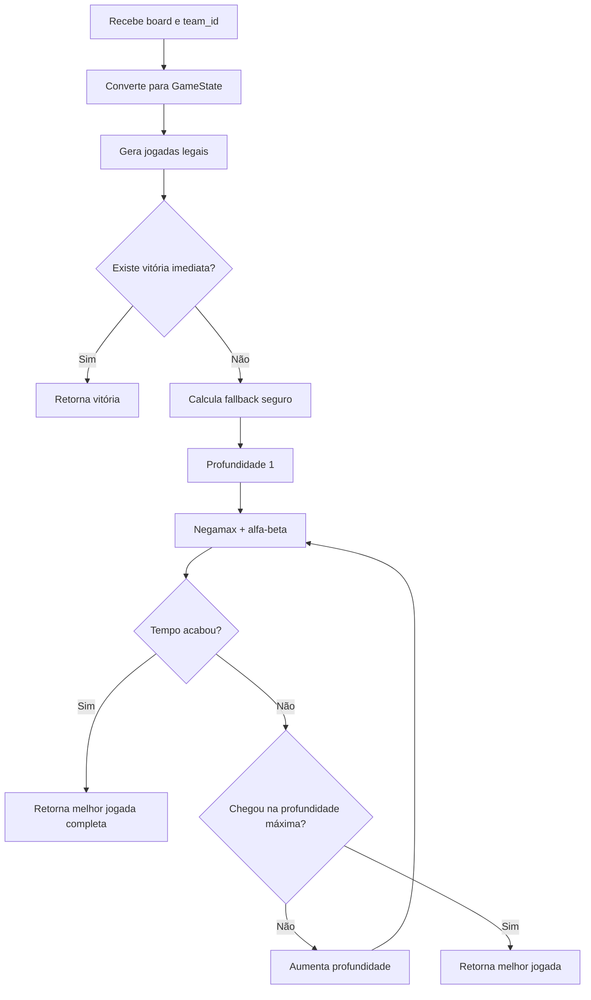

# Documentação Técnica — Eriguei (`logic_v3.py`)

## 1. Visão geral

O **Eriguei** é a terceira inteligência artificial do projeto, implementada no arquivo `logic_v3.py`. Ele é o bot mais avançado da família porque deixa de ser apenas uma heurística tática e passa a usar **busca adversarial**, isto é, ele tenta prever não apenas sua própria melhor jogada, mas também a melhor resposta possível do adversário.

A arquitetura do Eriguei é inspirada em motores clássicos de jogos de tabuleiro:

- geração completa de jogadas legais;
- representação interna imutável do estado;
- detecção de vitórias imediatas;
- função de avaliação posicional;
- busca **Negamax**;
- poda **alfa-beta**;
- tabela de transposição;
- aprofundamento iterativo;
- limite de tempo por requisição;
- fallback seguro caso o tempo acabe.

Esse tipo de IA é adequado para jogos determinísticos, pequenos e de informação perfeita, como este jogo Palerma/Santorini-like.

### Identidade do bot

| Item | Valor |
|---|---|
| Nome do jogador | `Eriguei` |
| Arquivo | `logic_v3.py` |
| Tipo de IA | Busca adversarial com heurística |
| Algoritmo principal | Negamax com poda alfa-beta |
| Profundidade padrão | configurável, padrão `4` |
| Tempo padrão de busca | configurável, padrão `0.75s` |
| Usa fallback? | Sim |
| Usa tabela de transposição? | Sim |
| Simula resposta inimiga? | Sim |
| Objetivo | escolher a jogada mais forte contra um adversário racional |

---

## 2. Filosofia da IA

O Eriguei parte de uma premissa competitiva:

> Uma jogada só é realmente boa se continuar boa depois da melhor resposta do adversário.

Isso é diferente das versões anteriores:

```text
V1: escolhe a melhor nota imediata.
V2: simula o estado depois da própria jogada e mede ameaças imediatas.
V3: simula alternância de turnos entre os dois lados.
```

A lógica central é:

```text
minha jogada
→ melhor resposta do inimigo
→ minha melhor resposta
→ melhor resposta do inimigo
→ ...
```

Essa abordagem permite detectar armadilhas que uma heurística de 1 turno não percebe.

---

## 3. Estrutura geral do arquivo

```text
logic_v3.py
├── Constantes do jogo
├── Mapeamento dos professores
├── Configuração de busca
├── Vizinhos pré-computados
├── Dataclasses
│   ├── GameState
│   ├── SearchMove
│   └── TTEntry
├── Utilitários de conversão
├── Geração de jogadas legais
├── Detecção de vitória imediata
├── Aplicação de jogadas
├── Heurística posicional
├── Ordenação de jogadas
├── Motor SearchEngine
│   ├── negamax
│   ├── best_move
│   └── fallback
├── choose_setup
├── choose_turn
└── avaliar_estado de compatibilidade
```

---

## 4. Constantes principais

```python
BOARD_SIZE = 5
CELL_COUNT = BOARD_SIZE * BOARD_SIZE
MAX_LEVEL = 4
WIN_LEVEL = 3
```

| Constante | Significado |
|---|---|
| `BOARD_SIZE` | tabuleiro 5x5 |
| `CELL_COUNT` | 25 casas |
| `MAX_LEVEL` | nível máximo/cúpula/bloqueio |
| `WIN_LEVEL` | nível que vence a partida |

O Eriguei usa um tabuleiro linearizado de 25 posições para ganhar desempenho.

---

## 5. Mapeamento dos professores

```python
PROFESSORS = ("CLARO", "REY", "KARIN", "BEATRIZ")
PROF_TO_INDEX = {name: i for i, name in enumerate(PROFESSORS)}
TEAM_TO_PROF_INDEXES = {
    1: (PROF_TO_INDEX["CLARO"], PROF_TO_INDEX["REY"]),
    2: (PROF_TO_INDEX["KARIN"], PROF_TO_INDEX["BEATRIZ"]),
}
OPPONENT_TEAM = {1: 2, 2: 1}
```

Em vez de trabalhar diretamente com nomes em toda a busca, o Eriguei converte professores para índices:

| Professor | Índice |
|---|---:|
| `CLARO` | 0 |
| `REY` | 1 |
| `KARIN` | 2 |
| `BEATRIZ` | 3 |

Isso deixa o estado mais compacto e rápido.

---

## 6. Pontuações terminais

```python
WIN_SCORE = 1_000_000_000
INF = 10**18
```

`WIN_SCORE` é gigantesco para garantir que nenhuma vantagem posicional supere uma vitória real.

Exemplo:

```text
vitória imediata = +1.000.000.000
boa posição = talvez +200.000
```

Assim, a IA nunca troca uma vitória por uma posição aparentemente bonita.

---

## 7. Configuração por variável de ambiente

```python
MAX_SEARCH_DEPTH = int(os.getenv("PALERMA_MAX_SEARCH_DEPTH", "4"))
SEARCH_TIME_LIMIT_SECONDS = float(os.getenv("PALERMA_SEARCH_TIME_SECONDS", "0.75"))
```

Você pode controlar a força e o risco de timeout sem alterar o código.

| Variável | Função | Padrão |
|---|---|---:|
| `PALERMA_MAX_SEARCH_DEPTH` | profundidade máxima da busca | `4` |
| `PALERMA_SEARCH_TIME_SECONDS` | tempo máximo aproximado por jogada | `0.75` |

### Configurações recomendadas

| Ambiente | Tempo | Profundidade |
|---|---:|---:|
| servidor com timeout curto | `0.25` | `3` |
| competição equilibrada | `0.50` | `4` |
| servidor mais folgado | `0.75` a `1.20` | `4` ou `5` |

---

## 8. Limite de candidatos por profundidade

```python
CANDIDATE_LIMIT_BY_DEPTH = {
    4: 48,
    3: 56,
    2: 72,
}
```

Em profundidades maiores, o número de jogadas possíveis cresce rapidamente. Para manter a busca viável, o Eriguei ordena as jogadas e limita a quantidade explorada em alguns níveis.

Isso é uma técnica prática comum em motores de jogo:

```text
gerar muitas jogadas -> ordenar por prioridade -> analisar primeiro as mais promissoras
```

---

## 9. Linearização do tabuleiro

O Eriguei converte `(row, col)` para um índice único:

```python
def _idx(row: int, col: int) -> int:
    return row * BOARD_SIZE + col
```

E converte de volta:

```python
def _row_col(index: int) -> Tuple[int, int]:
    return divmod(index, BOARD_SIZE)
```

### Exemplo

| Coordenada | Índice |
|---|---:|
| `(0,0)` | 0 |
| `(0,4)` | 4 |
| `(1,0)` | 5 |
| `(2,2)` | 12 |
| `(4,4)` | 24 |

Essa representação acelera comparações, hashing e armazenamento em cache.

---

## 10. Vizinhos pré-computados

```python
NEIGHBORS = tuple(
    tuple(
        _idx(r + dr, c + dc)
        for dr, dc in DIRECOES
        if _in_bounds(r + dr, c + dc)
    )
    for r in range(BOARD_SIZE)
    for c in range(BOARD_SIZE)
)
```

Em vez de recalcular vizinhos toda hora, o Eriguei pré-calcula todos os vizinhos das 25 casas.

Vantagens:

- menos processamento durante a busca;
- código de geração de jogadas mais simples;
- maior velocidade em profundidades altas.

---

## 11. Bônus de centro

```python
CENTER_BONUS = tuple(
    4 - (abs(r - 2) + abs(c - 2))
    for r in range(BOARD_SIZE)
    for c in range(BOARD_SIZE)
)
```

O centro recebe bônus maior. Casas distantes recebem bônus menor ou negativo.

A ideia estratégica é:

- centro aumenta mobilidade;
- centro facilita atacar e defender;
- cantos são perigosos porque reduzem opções.

---

## 12. Dataclass `GameState`

```python
@dataclass(frozen=True)
class GameState:
    levels: Tuple[int, ...]
    positions: Tuple[int, int, int, int]
```

`GameState` é o estado interno da partida.

Campos:

| Campo | Significado |
|---|---|
| `levels` | tupla com os 25 níveis do tabuleiro |
| `positions` | posição dos 4 professores por índice |

Exemplo conceitual:

```python
GameState(
    levels=(0, 0, 1, ..., 2),
    positions=(12, 16, 7, 18),
)
```

Por ser `frozen=True`, o estado é imutável. Isso é excelente para:

- usar como chave de cache;
- evitar bugs por modificação acidental;
- comparar estados rapidamente.

---

## 13. Dataclass `SearchMove`

```python
@dataclass(frozen=True)
class SearchMove:
    prof_idx: int
    from_idx: int
    to_idx: int
    build_idx: Optional[int]
    is_win: bool = False
```

Representa uma jogada interna.

Campos:

| Campo | Significado |
|---|---|
| `prof_idx` | professor movido |
| `from_idx` | origem linearizada |
| `to_idx` | destino linearizado |
| `build_idx` | casa construída |
| `is_win` | indica se o movimento vence imediatamente |

---

## 14. Dataclass `TTEntry`

```python
@dataclass(frozen=True)
class TTEntry:
    depth: int
    score: int
    flag: str
    best_move: Optional[SearchMove]
```

Essa classe representa uma entrada da tabela de transposição.

A tabela de transposição armazena avaliações de estados já calculados. Isso evita recalcular a mesma posição quando ela aparece por outra ordem de jogadas.

Campos:

| Campo | Significado |
|---|---|
| `depth` | profundidade em que o estado foi avaliado |
| `score` | pontuação encontrada |
| `flag` | tipo da avaliação: `EXACT`, `LOWER`, `UPPER` |
| `best_move` | melhor jogada conhecida para aquele estado |

---

## 15. Conversão do board da API para estado interno

```python
def _board_to_state(board: List[List[Cell]]) -> GameState:
    levels = [0] * CELL_COUNT
    positions = [-1, -1, -1, -1]

    for r in range(BOARD_SIZE):
        for c in range(BOARD_SIZE):
            cell = board[r][c]
            index = _idx(r, c)
            levels[index] = int(cell.level)
            if cell.professor in PROF_TO_INDEX:
                positions[PROF_TO_INDEX[cell.professor]] = index

    return GameState(levels=tuple(levels), positions=tuple(positions))
```

Essa função transforma a estrutura recebida da API em uma representação otimizada para busca.

---

## 16. Validação de destino

```python
def _is_valid_move_destination(state, from_idx, to_idx) -> bool:
    if state.levels[to_idx] >= MAX_LEVEL:
        return False
    if _is_occupied(state, to_idx):
        return False
    return state.levels[to_idx] <= state.levels[from_idx] + 1
```

Um destino é válido se:

1. não é nível `4`;
2. não está ocupado;
3. não exige subir mais de um nível.

---

## 17. Geração de jogadas legais

A função `generate_moves` é uma das mais importantes.

```python
def generate_moves(state, team_id, *, only_winning=False) -> List[SearchMove]:
    moves = []

    for prof_idx in TEAM_TO_PROF_INDEXES[int(team_id)]:
        from_idx = state.positions[prof_idx]
        ...
```

Fluxo:

```text
para cada professor do time:
    para cada destino adjacente:
        se destino não é legal, ignora
        se destino é nível 3, adiciona jogada de vitória
        caso contrário:
            move professor mentalmente
            para cada construção adjacente ao destino:
                se construção é legal, adiciona jogada
```

### Tratamento de vitória

```python
if state.levels[to_idx] == WIN_LEVEL:
    moves.append(SearchMove(prof_idx, from_idx, to_idx, None, True))
    continue
```

Ao entrar no nível `3`, o movimento é terminal. Não precisa construir.

---

## 18. Detecção de movimento legal existente

```python
def has_any_legal_move(state: GameState, team_id: int) -> bool:
    ...
```

Essa função verifica se o jogador da vez tem pelo menos uma jogada possível.

Ela é usada na busca para detectar derrota por travamento:

```python
if not has_any_legal_move(state, team_id):
    return -WIN_SCORE + ply
```

---

## 19. Ameaças de vitória imediata

```python
def immediate_win_targets(state: GameState, team_id: int) -> Set[int]:
    targets = set()
    for prof_idx in TEAM_TO_PROF_INDEXES[int(team_id)]:
        from_idx = state.positions[prof_idx]
        if state.levels[from_idx] < WIN_LEVEL - 1:
            continue
        for to_idx in NEIGHBORS[from_idx]:
            if state.levels[to_idx] == WIN_LEVEL and _is_valid_move_destination(...):
                targets.add(to_idx)
    return targets
```

Essa função retorna as casas nível `3` que o time consegue alcançar agora.

Ela é usada para:

- detectar vitória imediata;
- avaliar ameaça própria;
- avaliar ameaça inimiga;
- ordenar jogadas;
- calcular fallback seguro.

---

## 20. Aplicação de jogada

```python
def apply_move(state: GameState, move: SearchMove) -> GameState:
    positions = list(state.positions)
    positions[move.prof_idx] = move.to_idx

    if move.build_idx is None:
        return GameState(levels=state.levels, positions=tuple(positions))

    levels = list(state.levels)
    levels[move.build_idx] += 1
    return GameState(levels=tuple(levels), positions=tuple(positions))
```

Como o estado é imutável, aplicar uma jogada cria um novo `GameState`.

Isso é essencial para a busca, porque cada ramo da árvore precisa ter seu próprio estado.

---

## 21. Heurística individual do professor

A função `_worker_features` avalia um professor isolado.

### Altura

```python
level_score = (0, 180, 900, 5000, -10000)
score += level_score[level]
```

Interpretação:

| Nível | Pontuação |
|---|---:|
| 0 | 0 |
| 1 | 180 |
| 2 | 900 |
| 3 | 5000 |
| 4 | -10000 |

Nível `2` é muito valioso porque permite ameaçar nível `3`.

### Centro

```python
score += CENTER_BONUS[pos] * 45
```

### Mobilidade

```python
reachable = _count_reachable_destinations(state, prof_idx)
score += reachable * 65
if reachable == 0:
    score -= 6000
elif reachable <= 2:
    score -= 900
```

Um professor preso é um grande problema. A IA penaliza severamente baixa mobilidade.

---

## 22. Potenciais de subida e ameaça

Dentro de `_worker_features`, o Eriguei analisa vizinhos:

```python
if target_level == WIN_LEVEL and level >= WIN_LEVEL - 1:
    score += 80_000
elif target_level == 2 and level >= 1:
    score += 2_200
elif target_level == level + 1:
    score += 420
elif target_level == level:
    score += 120
```

A prioridade é:

1. ameaça direta de vitória;
2. preparar caminho para nível `2`;
3. subir um nível;
4. manter nível atual.

---

## 23. Penalização de bordas e cantos

```python
if level <= 1:
    if (row in (0, 4)) and (col in (0, 4)):
        score -= 450
    elif row in (0, 4) or col in (0, 4):
        score -= 180
```

Professores baixos em borda/canto têm menos opções e são mais fáceis de bloquear.

---

## 24. Heurística de time

```python
def _team_features(state: GameState, team_id: int) -> int:
    score = _worker_features(state, prof_a) + _worker_features(state, prof_b)
    full_moves = _count_full_legal_moves_capped(state, team_id)
    score += full_moves * 18
    ...
```

A IA soma as avaliações dos dois professores e adiciona mobilidade total do time.

Se o time tem poucas jogadas:

```python
if full_moves == 0:
    score -= 100_000
elif full_moves <= 8:
    score -= 2_500
```

---

## 25. Coordenação entre professores

```python
if cheb == 1:
    score -= 120
elif cheb == 2:
    score += 220
elif cheb == 3:
    score += 80
else:
    score -= 260
```

Diferente da V2, a V3 penaliza levemente professores colados (`cheb == 1`). Isso acontece porque, em busca profunda, professores colados podem bloquear as próprias rotas.

A distância preferida é `2`.

---

## 26. Avaliação estática do estado

```python
def evaluate_state(state: GameState, perspective_team: int) -> int:
    my_team = int(perspective_team)
    enemy_team = _opponent(my_team)

    my_threats = immediate_win_targets(state, my_team)
    enemy_threats = immediate_win_targets(state, enemy_team)

    score = 0
    score += _team_features(state, my_team)
    score -= _team_features(state, enemy_team)
    score += len(my_threats) * 140_000
    score -= len(enemy_threats) * 180_000
```

A avaliação é sempre relativa ao time da vez:

```text
score positivo = bom para mim
score negativo = bom para o adversário
```

A ameaça inimiga pesa mais que a própria ameaça:

- ameaça minha: `+140.000`;
- ameaça inimiga: `-180.000`.

Isso torna a IA defensivamente cuidadosa.

---

## 27. Ameaças duplas

```python
if len(my_threats) >= 2:
    score += 160_000
if len(enemy_threats) >= 2:
    score -= 220_000
```

Duas ameaças de vitória costumam ser muito fortes, porque o adversário talvez consiga bloquear apenas uma.

---

## 28. Ordenação de jogadas

Antes de pesquisar a árvore, o Eriguei ordena as jogadas.

```python
moves.sort(key=lambda m: _move_order_score(state, m, team_id, tt_best), reverse=True)
```

Ordenar jogadas é essencial para a poda alfa-beta. Quanto melhores as primeiras jogadas analisadas, mais ramos podem ser cortados.

---

## 29. Detectar construção que entrega vitória

```python
def _build_gives_enemy_win(state, move, enemy_team) -> bool:
    if move.build_idx is None:
        return False
    if state.levels[move.build_idx] + 1 != WIN_LEVEL:
        return False

    next_state = apply_move(state, move)
    return move.build_idx in immediate_win_targets(next_state, enemy_team)
```

Essa função evita o erro fatal:

```text
construir nível 3 para o inimigo vencer.
```

Na ordenação, esse erro recebe forte penalidade.

---

## 30. Detectar bloqueio de ameaça inimiga

```python
def _move_blocks_enemy_threat(state, move, enemy_team) -> bool:
    if move.build_idx is None:
        return False
    enemy_targets = immediate_win_targets(state, enemy_team)
    return bool(enemy_targets) and move.build_idx in enemy_targets and state.levels[move.build_idx] == WIN_LEVEL
```

Se a construção é feita em uma casa nível `3` que o inimigo poderia acessar, ela vira nível `4` e bloqueia a vitória.

---

## 31. Pontuação de ordenação

```python
if move.is_win:
    return 9_000_000

if _move_blocks_enemy_threat(...):
    score += 4_500_000

if _build_gives_enemy_win(...):
    score -= 3_000_000
```

A ordem de prioridade na busca é:

1. vitória imediata;
2. bloqueio de vitória inimiga;
3. evitar entregar vitória;
4. subir de nível;
5. ir para o centro;
6. construir de forma útil.

---

## 32. Classe `SearchEngine`

A classe `SearchEngine` controla a busca.

```python
class SearchEngine:
    def __init__(self, time_limit_seconds: float = SEARCH_TIME_LIMIT_SECONDS):
        self.deadline = time.perf_counter() + time_limit_seconds
        self.nodes = 0
        self.tt = {}
```

Campos:

| Campo | Significado |
|---|---|
| `deadline` | momento limite para parar busca |
| `nodes` | quantidade de nós avaliados |
| `tt` | tabela de transposição |

---

## 33. Controle de tempo

```python
def _check_time(self) -> None:
    self.nodes += 1
    if (self.nodes & 1023) == 0 and time.perf_counter() >= self.deadline:
        raise SearchTimeout
```

A IA não verifica o tempo a cada nó, mas a cada 1024 nós. Isso reduz overhead.

Se o tempo acaba, ela lança `SearchTimeout`, e o motor usa a melhor jogada encontrada até então.

---

## 34. Negamax

O método principal é:

```python
def negamax(self, state, team_id, depth, alpha, beta, ply) -> int:
    ...
```

Negamax é uma forma compacta de Minimax baseada na ideia:

```text
valor_para_mim = -valor_para_o_adversário
```

Se uma posição é ótima para o inimigo, ela é ruim para mim.

---

## 35. Terminais da busca

### Vitória imediata

```python
if has_immediate_win(state, team_id):
    return WIN_SCORE - ply
```

Se o jogador da vez pode vencer, o estado é terminal positivo.

O `- ply` faz a IA preferir vencer mais cedo.

### Sem jogada legal

```python
if not has_any_legal_move(state, team_id):
    return -WIN_SCORE + ply
```

Se o jogador da vez não tem jogada legal, ele perde. O `+ ply` faz a IA preferir adiar derrotas quando não há saída.

### Profundidade zero

```python
if depth <= 0:
    return evaluate_state(state, team_id)
```

Quando a busca não pode ir mais fundo, usa a heurística.

---

## 36. Tabela de transposição

O Eriguei usa chave:

```python
key = (state.levels, state.positions, int(team_id), int(depth))
```

Se esse estado já foi avaliado com profundidade suficiente, ele reutiliza o resultado.

Flags:

| Flag | Significado |
|---|---|
| `EXACT` | valor exato do estado |
| `LOWER` | limite inferior |
| `UPPER` | limite superior |

Essa técnica melhora desempenho em árvores com transposições.

---

## 37. Poda alfa-beta

Dentro do loop de jogadas:

```python
alpha = max(alpha, score)
if alpha >= beta:
    break
```

A poda alfa-beta elimina ramos que não podem alterar a decisão final.

Exemplo conceitual:

```text
Já achei uma jogada muito boa.
Estou analisando outra linha.
O inimigo já tem resposta que torna essa linha pior.
Então não preciso continuar essa linha.
```

---

## 38. Aprofundamento iterativo

No método `best_move`, a IA busca profundidade por profundidade:

```python
for depth in range(1, MAX_SEARCH_DEPTH + 1):
    try:
        ...
    except SearchTimeout:
        break
```

Isso é importante porque:

- se o tempo acabar na profundidade 4, a IA ainda tem a melhor jogada da profundidade 3;
- evita perder por timeout;
- melhora a ordenação da próxima profundidade.

---

## 39. Principal variation primeiro

```python
moves = list(root_moves)
if best_move in moves:
    moves.remove(best_move)
    moves.insert(0, best_move)
```

A melhor jogada da profundidade anterior é testada primeiro na próxima profundidade. Isso ajuda a alfa-beta cortar mais ramos.

---

## 40. Fallback seguro

Antes da busca profunda, a IA calcula uma jogada fallback:

```python
best_move = self._fallback_move(state, team_id, root_moves)
```

Se a busca não completar, ela ainda retorna uma jogada razoável.

Na função fallback:

```python
if has_immediate_win(child, enemy_team):
    score -= 900_000_000
if has_immediate_win(child, team_id):
    score += 600_000
if _move_blocks_enemy_threat(...):
    score += 700_000
if _build_gives_enemy_win(...):
    score -= 700_000
```

Isso impede que, por falta de tempo, o bot escolha uma jogada que entrega vitória imediata.

---

## 41. Fluxo completo do `best_move`

```text
1. Gera e ordena jogadas legais da raiz.
2. Se não houver jogada, retorna None.
3. Se houver vitória imediata, retorna vitória.
4. Calcula fallback rápido.
5. Busca profundidade 1.
6. Busca profundidade 2.
7. Busca profundidade 3.
8. Busca profundidade 4 ou limite configurado.
9. Se tempo acabar, mantém melhor profundidade completa.
10. Retorna melhor jogada.
```

---

## 42. Fluxograma do Eriguei



---

## 43. Setup competitivo

O setup da V3 considera vários fatores:

```python
def choose_setup(board: List[List[Cell]], team_id: int = 1) -> SetupResponse:
    state = _board_to_state(board)
    team_id = int(team_id)
    enemy_team = _opponent(team_id)
    ...
```

Critérios documentados no próprio código:

- preferir centro e anel interno;
- manter boa mobilidade;
- se já existe um aliado, ficar a distância 2 ou 3 dele;
- evitar canto/borda quando houver opções melhores;
- não grudar nos inimigos durante a abertura.

---

## 44. Pontuação de setup

### Centro e mobilidade

```python
score += CENTER_BONUS[index] * 1_000
score += len(NEIGHBORS[index]) * 80
```

### Penalizar bordas/cantos

```python
if canto:
    score -= 1_200
elif borda:
    score -= 450
```

### Distância do aliado

```python
if cheb == 1:
    score -= 650
elif cheb == 2:
    score += 950
elif cheb == 3:
    score += 250
else:
    score -= 250
```

A V3 prefere o segundo professor a distância 2 do primeiro.

### Distância do inimigo

```python
if cheb == 1:
    score -= 300
elif cheb == 2:
    score += 120
```

---

## 45. Preferência de abertura

```python
opening_preference = {
    _idx(2, 2): 90,
    _idx(1, 1): 70,
    _idx(1, 3): 68,
    _idx(3, 1): 66,
    _idx(3, 3): 64,
    _idx(1, 2): 55,
    _idx(2, 1): 54,
    _idx(2, 3): 53,
    _idx(3, 2): 52,
}
```

Isso serve como desempate determinístico para manter aberturas fortes e previsíveis no bom sentido.

---

## 46. Função pública `choose_turn`

```python
def choose_turn(board: List[List[Cell]], team_id: int) -> Optional[PlayerTurnResponse]:
    state = _board_to_state(board)
    engine = SearchEngine()
    move = engine.best_move(state, int(team_id))
    if move is None:
        return None
    return _response_from_move(move)
```

A API chama `choose_turn`; essa função:

1. converte o board;
2. cria motor de busca;
3. escolhe melhor jogada;
4. converte `SearchMove` para `PlayerTurnResponse`.

---

## 47. Conversão de resposta

```python
def _response_from_move(move: SearchMove) -> PlayerTurnResponse:
    move_r, move_c = _row_col(move.to_idx)

    if move.is_win or move.build_idx is None:
        return PlayerTurnResponse(
            professor=PROFESSORS[move.prof_idx],
            move_to=Position(row=move_r, col=move_c),
            mentor_at=None,
        )
```

Se a jogada vence, `mentor_at` é omitido (`None`). Caso contrário, a construção é convertida para coordenadas.

---

## 48. Estratégia de jogo do Eriguei

A estratégia do Eriguei é:

```text
1. Vencer imediatamente se possível.
2. Impedir vitória imediata do adversário.
3. Evitar entregar vitória ao adversário.
4. Simular respostas inimigas.
5. Criar ameaças múltiplas.
6. Manter professores móveis.
7. Controlar centro.
8. Subir para nível 2 com segurança.
9. Reduzir mobilidade inimiga quando possível.
```

---

## 49. Por que Negamax é adequado aqui

O jogo tem características ideais para busca adversarial:

- tabuleiro pequeno;
- informação perfeita;
- sem sorte;
- jogadas discretas;
- vitória claramente definida.

Então a IA pode explorar uma árvore de possibilidades e escolher a linha mais segura.

---

## 50. Comparação entre V1, V2 e V3

| Critério | V1 | V2 | V3 / Eriguei |
|---|---|---|---|
| Tipo | gulosa | tática 1-turno | adversarial profunda |
| Representação | dicionários | dataclasses + matrizes | estado imutável linearizado |
| Setup | lista fixa | heurístico contextual | heurístico competitivo |
| Simula estado futuro | não | sim, próprio turno | sim, alternância de turnos |
| Simula inimigo | não | ameaças imediatas | melhor resposta via Negamax |
| Controle de tempo | não precisa | não precisa muito | sim |
| Fallback | não | não explícito | sim |
| Tabela de transposição | não | não | sim |
| Força potencial | média | alta | muito alta se houver tempo |

---

## 51. Pontos fortes

### 51.1 Planejamento real

Ele considera a resposta inimiga.

### 51.2 Segurança contra timeout

Usa limite de tempo e fallback.

### 51.3 Boa avaliação posicional

Leva em conta altura, centro, mobilidade, ameaças e coordenação.

### 51.4 Poda alfa-beta

Evita analisar ramos inúteis.

### 51.5 Tabela de transposição

Reutiliza cálculos já feitos.

### 51.6 Aprofundamento iterativo

Sempre tem uma resposta mesmo se o tempo acabar.

---

## 52. Limitações

### 52.1 Depende do tempo disponível

Se o tempo de busca for muito baixo, a V3 pode jogar parecida com uma versão heurística.

### 52.2 Pesos ainda são manuais

A avaliação não foi treinada automaticamente.

### 52.3 Candidate pruning pode cortar uma jogada boa

Limitar candidatos melhora velocidade, mas pode descartar uma jogada surpreendente.

### 52.4 Não resolve o jogo matematicamente

Ela busca até certa profundidade, não até o fim completo da partida.

---

## 53. Quando Eriguei tende a vencer

Ele tende a vencer contra bots que:

- não simulam o adversário;
- criam ameaças simples;
- dependem de heurísticas locais;
- não detectam sequência forçada;
- não reduzem mobilidade inimiga.

---

## 54. Quando Eriguei pode perder

Ele pode perder se:

- o servidor tiver timeout muito curto;
- a profundidade estiver baixa;
- a heurística avaliar mal uma posição de longo prazo;
- o adversário explorar uma abertura específica;
- houver bug de backend, slot ou `your_team`.

---

## 55. Estratégia competitiva recomendada

Para torneio, usar:

```bash
PALERMA_SEARCH_TIME_SECONDS=0.50
PALERMA_MAX_SEARCH_DEPTH=4
```

Se não houver timeout, testar:

```bash
PALERMA_SEARCH_TIME_SECONDS=0.75
PALERMA_MAX_SEARCH_DEPTH=4
```

Se o servidor permitir tempo maior:

```bash
PALERMA_SEARCH_TIME_SECONDS=1.20
PALERMA_MAX_SEARCH_DEPTH=5
```

Se começar a perder por timeout:

```bash
PALERMA_SEARCH_TIME_SECONDS=0.25
PALERMA_MAX_SEARCH_DEPTH=3
```

---

## 56. Como depurar decisões

Adicionar logs temporários em `choose_turn`:

```python
print("team_id:", team_id)
print("state:", state)
print("move:", move)
```

Dentro do `SearchEngine`, logs úteis seriam:

```python
print("nodes:", self.nodes)
print("best_move:", best_move)
print("best_score:", best_score)
```

---

## 57. Sugestões de evolução futura

### 57.1 Killer moves

Guardar jogadas que causaram cortes alfa-beta e testá-las cedo em outros ramos.

### 57.2 History heuristic

Dar prioridade a jogadas que historicamente foram boas em várias posições.

### 57.3 Quiescence search

Quando a profundidade acabar em posição tática instável, continuar analisando apenas ameaças de vitória.

### 57.4 Self-play para calibrar pesos

Rodar milhares de partidas entre versões e ajustar pesos automaticamente.

### 57.5 Livro de abertura

Criar respostas preparadas para os primeiros posicionamentos.

---

## 58. Resumo executivo

O **Eriguei** é a IA mais sofisticada do projeto. Ele transforma o bot em um motor de decisão adversarial, usando Negamax, poda alfa-beta, tabela de transposição, ordenação de jogadas, aprofundamento iterativo e fallback seguro. Seu objetivo não é apenas fazer uma boa jogada agora, mas escolher uma jogada que continue forte contra a melhor resposta possível do inimigo.

### Classificação final

| Critério | Nota conceitual |
|---|---|
| Velocidade | Média a alta, dependendo da configuração |
| Segurança técnica | Alta por causa do fallback |
| Estratégia local | Muito alta |
| Defesa tática | Muito alta |
| Planejamento futuro | Alto |
| Força competitiva | Muito alta quando há tempo de busca suficiente |

